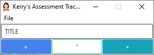
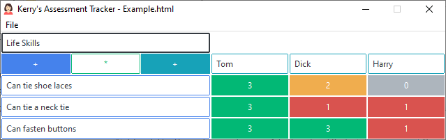

# Kerry's Assessment Tracker v1.0.1

A tool to track pupil progress using a simple traffic light system.

## Installation

Extract the ZIP file to a folder on your Windows PC and run Kat.exe.

## Usage

A simple screen with no data is presented when the application is started

 

Replace "Title" with the title for the tracker being created.

 adds a new row.

 adds a new column.

Rows are best used for assessment targets and columns for pupils. *However scroll bars have not yet been implemented so inverting this use may work better depending upon your requirements.*

Once rows and columns have been added, each row and column can be assigned a title by typing in the entry box.

Each main cell can be cycled through the values 0 to 3 by clicking the button.

 

 will show additional controls that allow rows and columns to be moved or deleted.

 

Pressing the button again will hide the additional controls and return to the simpler view.

The File menu provides the following functions:

* **New:** creates a new file discarding any existing rows and columns
* **Open:** opens an existing file for further editing
* **Save:** saves the current data to an already opened file
* **Save As:** allows the current data to be saved to a different or new file
* **View HTML:** opens the saved file in the default browser for viewing and/or printing
* **View Manual:** opens this manual for viewing
* **View Homepage:** opens the project's homepage on GitHub (releases are available on the right side of the homepage)

### HTML Files

Files are saved as standard HTML files as used on the internet. The main data table in the document is specially marked so the data can be re-loaded when the file is opened in the KAT application.

The HTML file includes the full data table as displayed in KAT, it also includes a per-column table allowing printed output to be placed in pupil's books. When printing a page-break is inserted between the full data table and the per-column tables, the printed output attempts to not split tables across pages. To include the cell colours in a print out it may be necessary to enable background colours in your browser's print settings

# Notices

**Kerry's Assessment Tracker - A tool to track pupil progress using a simple traffic light system**

https://github.com/marjohloo/Kat

Copyright Martin Looker 2022

This program is free software: you can redistribute it and/or modify it under the terms of the GNU General Public License as published by the Free Software Foundation, either version 3 of the License, or (at your option) any later version.

This program is distributed in the hope that it will be useful, but WITHOUT ANY WARRANTY; without even the implied warranty of MERCHANTABILITY or FITNESS FOR A PARTICULAR PURPOSE. See the GNU General Public License for more details.

You should have received a copy of the GNU General Public License along with this program. If not, see <https://www.gnu.org/licenses/>.
